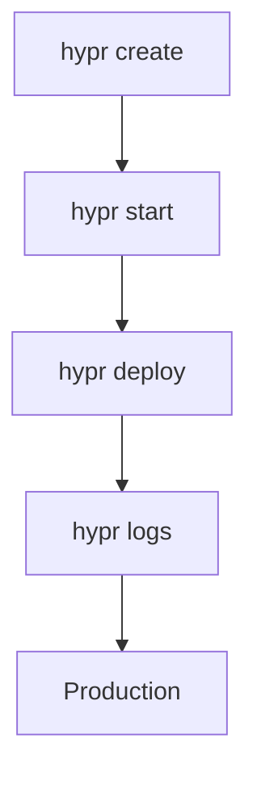

## Overview

Hypr provides a powerful CLI for creating, managing, and deploying microVMs. You interact with it using the `hypr` command followed by subcommands like `create`, `list`, `start`, and `deploy`. Install the CLI via your package manager, then run `hypr --help` to see all options.

<Columns cols={3}>
  <Card title="Create VMs" icon="plus" href="#">
    Build new microVMs from images with custom resources.
  </Card>
  <Card title="Manage VMs" icon="settings" href="#">
    List, start, stop, and delete your microVMs efficiently.
  </Card>
  <Card title="Deploy" icon="rocket" href="#">
    Deploy VMs to cloud providers with one command.
  </Card>
</Columns>

## Core Commands

Use these essential subcommands to handle your microVM lifecycle.

| Command | Description | Example |
|---------|-------------|---------|
| `hypr create` | Create a new microVM | `hypr create --image ubuntu:22.04 --name app-vm --cpu 2 --memory 2048` |
| `hypr list` | List all microVMs | `hypr list --status running` |
| `hypr start` | Start a stopped microVM | `hypr start app-vm` |
| `hypr stop` | Stop a running microVM | `hypr stop app-vm` |
| `hypr delete` | Delete a microVM | `hypr delete app-vm --force` |
| `hypr deploy` | Deploy to cloud | `hypr deploy app-vm --provider aws --region us-east-1` |
| `hypr logs` | View logs | `hypr logs app-vm --tail 100` |
| `hypr exec` | Run command inside VM | `hypr exec app-vm -- curl https://api.example.com/health` |

<Callout kind="tip">
  Run `hypr <subcommand> --help` for detailed flags and options.
</Callout>

## Common Usage Examples

Follow these steps to create and deploy your first microVM.

<Steps>
  <Step title="Install Hypr CLI" icon="download">
    Choose your platform and install the CLI.

    <Tabs>
      <Tab title="macOS" icon="apple">
        ```bash
        brew install hypr/tap/hypr
        ```
      </Tab>
      <Tab title="Linux" icon="linux">
        ```bash
        curl -fsSL https://get.hypr.dev | bash
        sudo mv hypr /usr/local/bin/
        ```
      </Tab>
      <Tab title="Windows" icon="windows">
        Use winget or download the binary from releases.
      </Tab>
    </Tabs>
  </Step>
  <Step title="Create VM" icon="plus">
    Launch a VM with your app image.

    ```bash
    hypr create \
      --image node:20-alpine \
      --name web-app \
      --cpu 2 \
      --memory 1024 \
      --port 3000:8080
    ```
  </Step>
  <Step title="Start and Deploy" icon="rocket">
    Start locally or deploy to cloud.

    <CodeGroup tabs="Local,Cloud">
      ```bash
      hypr start web-app
      hypr logs web-app --follow
      ```
      ```bash
      hypr deploy web-app --provider fly --region ord
      ```
    </CodeGroup>
  </Step>
</Steps>

## Advanced Options

Customize your VMs with these flags.

<Expandable title="Networking Configuration" default-open="false">
  Expose ports and set hostnames:

  ```bash
  hypr create --image alpine:latest \
    --name api-server \
    --port 80:8080 \
    --port 443:8443 \
    --hostname api.example.com
  ```
</Expandable>

<Expandable title="Resource Limits" default-open="false">
  Set CPU, memory, and disk:

  ```bash
  hypr create --image ubuntu:22.04 \
    --cpu 4 \
    --memory 4096 \
    --disk 20GB \
    --name production-db
  ```
</Expandable>

## Troubleshooting

Common issues and fixes:

<Callout kind="alert">
  Ensure you run commands with sufficient privileges. Use `sudo` if accessing host resources.
</Callout>

| Issue | Solution |
|-------|----------|
| `Permission denied` | Run `sudo hypr <command>` or configure user namespaces. |
| `Image not found` | Verify image name: `hypr images list`. Pull with `hypr pull ubuntu:22.04`. |
| `Port already in use` | Check with `hypr list --ports` and free the port. |
| `Deploy failed` | Set `HYPR_CLOUD_KEY=your-cloud-key` and check quotas. |

For logs, always use `hypr logs <vm> --debug`. Update CLI with `hypr self-update`.

