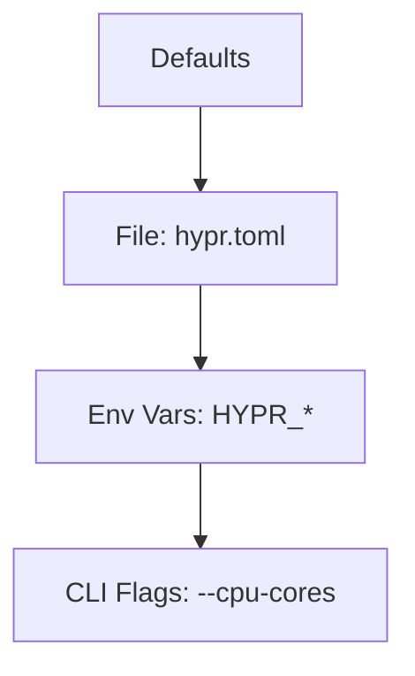

## Overview

Hypr uses a flexible configuration system that lets you tailor the microvm runtime to your workloads. You specify settings via TOML files, environment variables, or command-line flags. This approach ensures portability across environments while allowing fine-grained control over CPU, memory, networking, and security features.

<Columns cols={3}>
  <Card title="File Config" icon="file" href="#file-config">
    Persistent settings in TOML format for repeatable deployments.
  </Card>
  <Card title="Env Variables" icon="terminal" href="#env-vars">
    Quick overrides without files, ideal for CI/CD pipelines.
  </Card>
  <Card title="Runtime Flags" icon="settings" href="#flags">
    One-off tweaks for testing and debugging.
  </Card>
</Columns>

<Callout kind="tip">
  Start with a minimal config and add options incrementally to avoid conflicts.
</Callout>

## Configuration File Format

Hypr loads configuration from `hypr.toml` by default. Place this file in your working directory or specify a custom path with the `--config` flag.

<Steps>
  <Step title="Create Config File" icon="file">
    Generate a basic TOML file:

    ```toml
    [runtime]
    cpu_cores = 2
    memory_mb = 1024
    ```
  </Step>
  <Step title="Validate Syntax" icon="check-circle">
    Run `hypr validate hypr.toml` to check for errors before deployment.
  </Step>
  <Step title="Load Config" icon="play">
    Start your microvm: `hypr run --config hypr.toml your-image`.
  </Step>
</Steps>

## Essential Runtime Options

Customize core resources and behavior with these key settings. Use the table below for quick reference.

| Option | Type | Default | Description |
|--------|------|---------|-------------|
| `cpu_cores` | integer | 1 | Number of virtual CPU cores (`<8` for most workloads). |
| `memory_mb` | integer | 512 | RAM allocation in megabytes. |
| `network_mode` | string | "host" | Options: `host`, `bridge`, `nat`. |
| `rootfs` | string | "/dev/null" | Root filesystem path or image. |

<CodeGroup tabs="TOML,Bash">
  ```toml
  [runtime]
  cpu_cores = 4
  memory_mb = 2048
  network_mode = "bridge"
  ```
  ```bash
  export HYPR_CPU_CORES=4
  export HYPR_MEMORY_MB=2048
  export HYPR_NETWORK_MODE=bridge
  hypr run your-image
  ```
</CodeGroup>

## Environment Variables

Override file settings dynamically. Prefix variables with `HYPR_` and use uppercase snake_case.

<Tabs>
  <Tab title="Production" icon="cloud">
    ```bash
    HYPR_LOG_LEVEL=info \
    HYPR_NETWORK_MODE=nat \
    hypr run prod-image
    ```

    Set these in your Dockerfile or deployment script for cloud runs.
  </Tab>
  <Tab title="Development" icon="code">
    ```bash
    HYPR_CPU_CORES=1 \
    HYPR_LOG_LEVEL=debug \
    HYPR_DISABLE_SECURITY=true \
    hypr run dev-image
    ```

    Enable debug logging to troubleshoot startup issues.
  </Tab>
</Tabs>

<Callout kind="alert">
  Environment variables take precedence over file config. Use them sparingly to maintain portability.
</Callout>

## Advanced Deployment Settings

For production deployments, tune security and performance options.

<ExpandableGroup>
  <Expandable title="Security Hardening" default-open="true">
    Enable seccomp and namespaces:

    ```toml
    [security]
    seccomp_profile = "strict"
    capabilities = ["NET_BIND_SERVICE"]
    ```
  </Expandable>
  <Expandable title="Persistent Storage">
    Mount volumes for stateful apps:

    ```toml
    [[volumes]]
    host_path = "/data"
    guest_path = "/app/data"
    ```
  </Expandable>
</ExpandableGroup>

## Loading Order and Precedence

Hypr merges configs in this order (last wins):



Review logs with `HYPR_LOG_LEVEL=debug` to confirm applied values. Test changes in a staging environment before production. This system empowers you to optimize Hypr for edge computing, serverless functions, or local development.