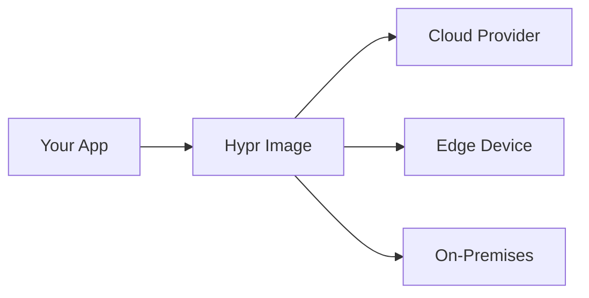

## Overview

Hypr provides a lightweight microVM runtime that enables you to package applications into portable virtual machines. Unlike traditional VMs, microVMs start in milliseconds and use minimal resources, making them ideal for serverless and edge environments. You write your application once and deploy it across clouds, on-premises, or edge devices without modifications.



This diagram shows how Hypr images run consistently everywhere.

<Callout kind="info">
  MicroVMs boot `<100ms` and consume `<100MB` RAM, perfect for modern workloads.
</Callout>

## Key Features

Hypr stands out with these core capabilities:

<Columns cols={3}>
  <Card title="Lightning Fast" icon="zap" href="/docs/performance">
    Boots in under 50ms with kernel optimizations for instant scaling.
  </Card>
  <Card title="Portable" icon="package" href="/docs/images">
    Single image format works across AWS, GCP, Kubernetes, and bare metal.
  </Card>
  <Card title="Secure" icon="shield" href="/docs/security">
    Hardware-enforced isolation with seccomp and namespace controls.
  </Card>
</Columns>

## Quick Start

Get running in minutes:

<Steps>
  <Step title="Install Hypr" icon="download">
    Use Cargo for the CLI tool.

    <CodeGroup tabs="Linux/macOS,Windows">
      ```bash
      curl --proto '=https' --tlsv1.2 -sSf https://sh.hypr.run/install.sh | sh
      ```
      ```powershell
      iwr -useb https://sh.hypr.run/install.ps1 | iex
      ```
    </CodeGroup>
  </Step>
  <Step title="Create Image" icon="image">
    Build from Dockerfile or OCI image.

    ```bash
    hypr build --dockerfile Dockerfile --output myapp.img
    ```
  </Step>
  <Step title="Run MicroVM" icon="play">
    Launch locally or deploy.

    ```bash
    hypr run myapp.img --cpus 2 --memory 512MB --port 8080:80
    ```
  </Step>
</Steps>

## Use Cases

Hypr fits various scenarios:

<Tabs>
  <Tab title="Serverless Functions" icon="cloud">
    Deploy functions that scale to zero with minimal cold starts. Integrate with Kubernetes or Knative for event-driven apps.
  </Tab>
  <Tab title="Edge Computing" icon="globe">
    Run AI inference or IoT processing on devices with constrained resources. Sync state across distributed nodes.
  </Tab>
  <Tab title="CI/CD Pipelines" icon="git-branch">
    Speed up builds with isolated, reproducible environments. Replace heavy containers in GitHub Actions or Jenkins.
  </Tab>
</Tabs>

## Benefits

You gain portability without sacrificing performance. Hypr reduces vendor lock-in, cuts deployment times by 80%, and lowers costs through efficient resource use.

<Expandable title="Advanced Configuration" default-open="false">
  Customize kernel parameters and root filesystems:

  ```bash
  hypr run myapp.img \
    --kernel-args "console=ttyS0" \
    --rootfs /path/to/custom/rootfs
  ```
</Expandable>

Start building with Hypr today for seamless deployments.