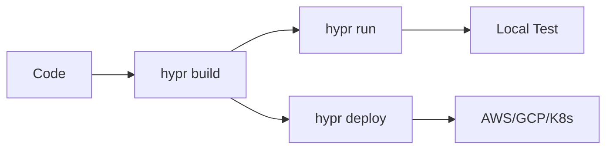

## Overview

Hypr lets you create lightweight microVMs that run consistently across platforms. You write your application once and deploy it anywhere—from local development to cloud providers. This guide walks you through setting up a project, running a basic microVM, and deploying to multiple platforms.

<Callout kind="tip">
  Ensure you have Docker installed, as Hypr uses it for building microVM images.
</Callout>

## Prerequisites

Before starting, install the Hypr CLI:

<CodeGroup tabs="macOS,Linux,Windows">
  ```bash
  # macOS (via Homebrew)
  brew install hypr
  ```
  ```bash
  # Linux (via package manager)
  curl -sSL https://get.hypr.sh | bash
  ```
  ```bash
  # Windows (via Scoop)
  scoop install hypr
  ```
</CodeGroup>

Verify installation:

```bash
hypr --version
```

You should see output like `hypr v0.5.0`.

## Create Your First Project

Follow these steps to initialize a new Hypr project.

<Steps>
  <Step title="Initialize project" icon="plus">
    Create a new directory and initialize:

    ```bash
    mkdir my-hypr-app
    cd my-hypr-app
    hypr init
    ```

    This generates a `hypr.yaml` configuration file and a basic `app.js` entrypoint.
  </Step>

  <Step title="Add your code" icon="code">
    Edit `app.js` to serve a simple HTTP server:

    ```javascript
    const http = require('http');

    const server = http.createServer((req, res) => {
      res.writeHead(200, { 'Content-Type': 'text/plain' });
      res.end('Hello from Hypr microVM!');
    });

    server.listen(8080, () => {
      console.log('Server running on port 8080');
    });
    ```
  </Step>

  <Step title="Build the microVM" icon="package">
    Build your image:

    ```bash
    hypr build
    ```

    Hypr creates a reproducible microVM image optimized for your app.
  </Step>
</Steps>

## Run Locally

Test your microVM on your machine:

```bash
hypr run
```

Access it at `http://localhost:8080`. You see `Hello from Hypr microVM!`.

<Callout kind="success">
  Your first microVM runs in under 100ms startup time.
</Callout>

## Deploy to Platforms

Hypr supports seamless deployment. Choose your platform:

<Tabs>
  <Tab title="AWS" icon="cloud">
    <ParamField path="region" param-type="string" required="true">
      AWS region like `us-east-1`.
    </ParamField>

    ```bash
    hypr deploy --platform=aws --region=us-east-1
    ```

    Hypr launches on AWS Firecracker with auto-scaling.
  </Tab>

  <Tab title="GCP" icon="database">
    Set `GCP_PROJECT_ID` environment variable first.

    ```bash
    export GCP_PROJECT_ID=your-project-123
    hypr deploy --platform=gcp
    ```
  </Tab>

  <Tab title="Kubernetes" icon="settings">
    ```bash
    hypr deploy --platform=k8s --kubeconfig=~/.kube/config
    ```

    Deploys as a microVM pod with persistent storage.
  </Tab>
</Tabs>

## Next Steps

Explore more with these resources:

<Columns cols={3}>
  <Card title="Configuration" icon="settings" href="/docs/configuration">
    Customize `hypr.yaml` for advanced networking and storage.
  </Card>

  <Card title="Scaling" icon="trending-up" href="/docs/scaling">
    Handle high traffic with zero-downtime updates.
  </Card>

  <Card title="Monitoring" icon="activity" href="/docs/monitoring">
    Integrate logs and metrics with Prometheus.
  </Card>
</Columns>



Your Hypr microVM now runs anywhere. Scale to production confidently.